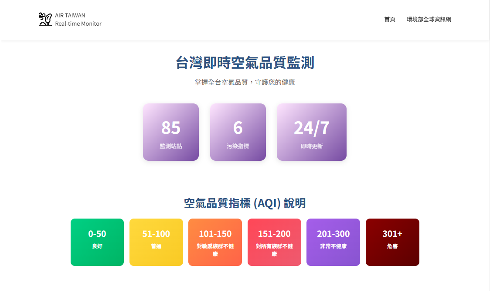
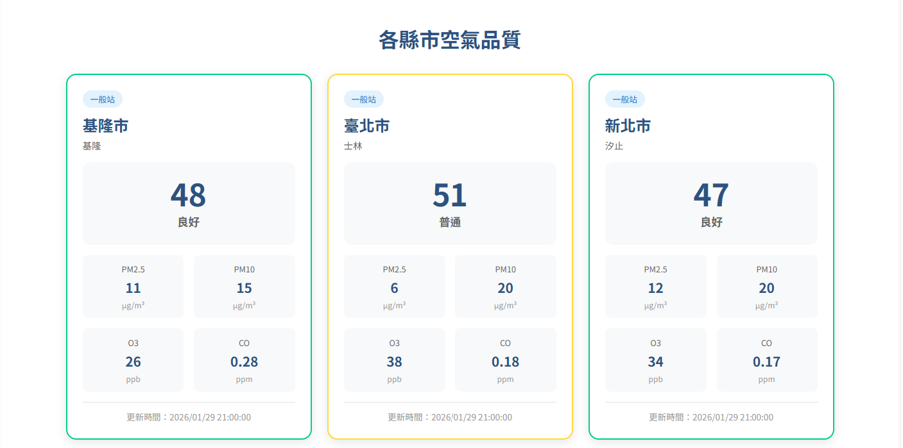
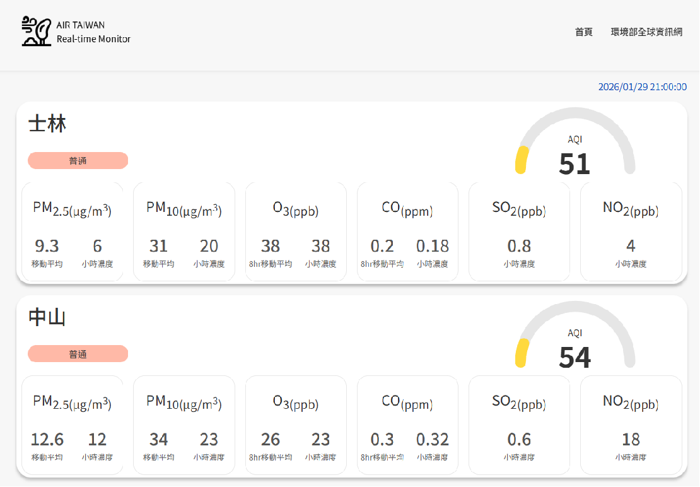

# AIR TAIWAN

## 畫面展示
### 首頁
  - **空氣品質指標(AQI)**
  
  - **各縣市空氣品質**
  
### 縣市分頁
  - **縣市各站點空氣品質**
  

## 組員分工

### 前後端分離
**前端**
  - **台灣首頁 晨瑄**
  - **縣市分頁 惠佳**

**後端**
  - **整理API 奇勳**
  - **架設網站 奇勳**

## 前後端工作項目
### 前端工作項目
  1. 動態和靜態網頁
  2. 統一頁面樣式
  - 字型和大小
  - 主題顏色
  - base 頁面
### 後端工作項目
  1. 撈取主題API
  2. API 規劃好給前端
  3. 架設網站

## API規格
### 即時空氣品質API規格
網址: /api/airquality
```python
{
  "city":"台北市",
  "location":"大同",
    "airquality":{
      "AQI":48,
      "status":"良好",
      "pm2.5":7,
      "pm2.5_avg":7.5,
      "pm10":0,
      "pm10_avg":6,
      "o3":25,
      "o3_8hr":15,
      "co":0.5,
      "co_8hr":0.8,
      "so2":0.7,
      "no2":20
    },
  "time":'2026/01/28 00:00:00'
}
```
## reference:

**引用API**
[環境部環境資料開放平台開放資料API](https://data.moenv.gov.tw/swagger/#/)
**規格書參考**
[API 使用說明](https://data.moenv.gov.tw/paradigm)
